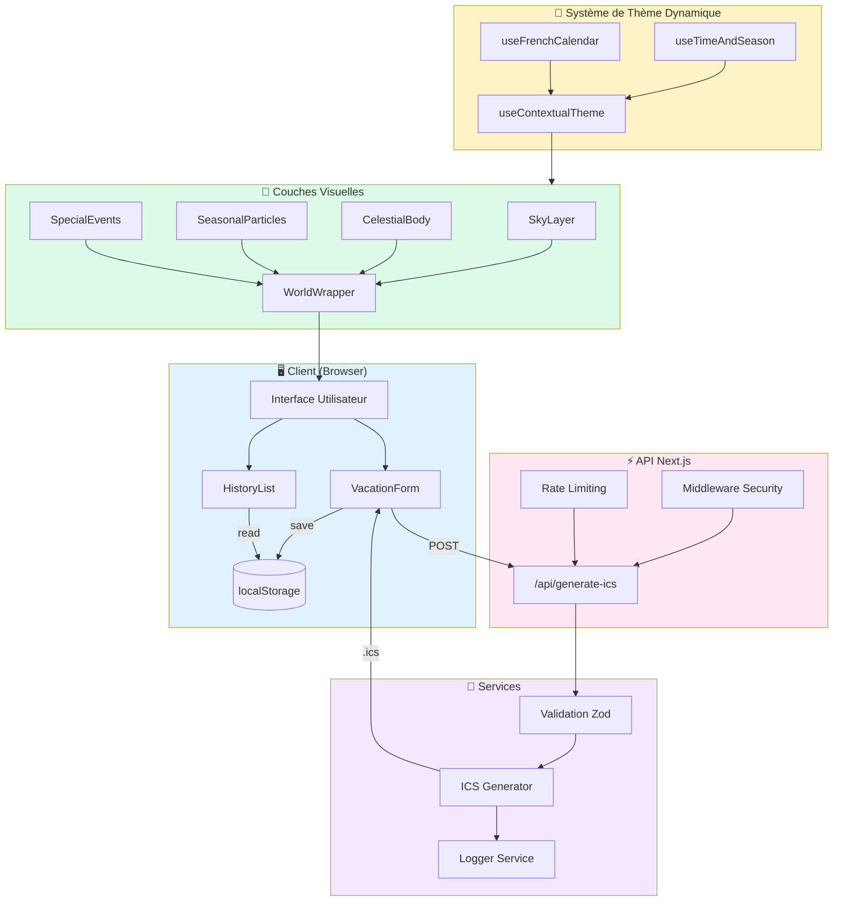

# PGV Planning

**Générateur de fichiers ICS vivant, sécurisé et responsive**

Un générateur de fichiers calendrier ICS avec une interface dynamique qui s'adapte à l'heure du jour, aux saisons et aux événements spéciaux.

## Fonctionnalités

- **Génération ICS** : Créez des fichiers calendrier compatibles avec tous les clients (Google Calendar, Outlook, Apple Calendar)
- **Interface vivante** : Thème dynamique basé sur l'heure (aube, jour, crépuscule, nuit) et les saisons
- **Particules contextuelles** : Neige en hiver, pétales au printemps, lucioles en été, feuilles en automne
- **Événements spéciaux** : Animations pour Noël, Halloween, 14 Juillet, Saint-Valentin
- **Historique local** : Retrouvez et re-téléchargez vos fichiers générés
- **Accessibilité** : Support du mode reduced-motion, contraste élevé
- **Sécurité** : Validation Zod, headers CSP, rate limiting

## Stack Technique

| Catégorie | Technologies |
|-----------|-------------|
| Framework | Next.js 15 (App Router) |
| Langage | TypeScript (strict) |
| Styles | Tailwind CSS |
| Animations | Framer Motion |
| Validation | Zod |
| Dates | date-fns, date-holidays |
| Fichiers ICS | ics |
| UI | Lucide React, Sonner, Canvas Confetti |

## Installation

```bash
# Cloner le repository
git clone https://github.com/Adam-Blf/pgvplaning.git
cd pgvplaning

# Installer les dépendances
npm install

# Lancer en développement
npm run dev

# Build production
npm run build

# Lancer les tests
npm test
```

## Diagramme d'Architecture



## Architecture Fichiers

```
pgvplanning/
├── app/                           # Pages Next.js (App Router)
│   ├── api/generate-ics/         # API de génération ICS
│   ├── layout.tsx                # Layout principal + Toaster
│   ├── page.tsx                  # Page d'accueil
│   ├── not-found.tsx             # Page 404
│   ├── error.tsx                 # Page d'erreur
│   ├── loading.tsx               # Loading state
│   └── manifest.ts               # PWA Manifest
├── components/
│   ├── features/                 # Composants fonctionnels
│   │   ├── vacation-form.tsx     # Formulaire de saisie
│   │   └── history-list.tsx      # Liste historique
│   ├── layout/                   # Composants layout
│   │   ├── backgrounds/          # Couches de fond animées
│   │   │   ├── sky-layer.tsx     # Gradient ciel
│   │   │   ├── celestial-body.tsx # Soleil/Lune
│   │   │   ├── seasonal-particles.tsx # Particules Canvas
│   │   │   └── special-events.tsx # Événements spéciaux
│   │   ├── world-wrapper.tsx     # Assemblage backgrounds
│   │   └── page-transition.tsx   # Transitions de page
│   └── ui/                       # Composants atomiques
│       ├── magnetic-button.tsx   # Bouton magnétique
│       ├── glass-card.tsx        # Carte glass effect
│       └── animated-input.tsx    # Input animé
├── hooks/                        # Hooks React
│   ├── use-french-calendar.ts    # Jours fériés FR
│   ├── use-time-season.ts        # Heure et saisons
│   ├── use-contextual-theme.ts   # Thème contextuel
│   ├── use-history.ts            # Historique localStorage
│   ├── use-reduced-motion.ts     # Accessibilité
│   └── use-konami-code.ts        # Easter egg
├── lib/
│   ├── schemas/planning.ts       # Schémas Zod
│   ├── services/ics-generator.ts # Générateur ICS
│   ├── utils/
│   │   ├── date-format.ts        # Formatage dates FR
│   │   └── sound.ts              # Sons optionnels
│   └── logger.ts                 # Service de logging
├── __tests__/                    # Tests
│   ├── unit/                     # Tests unitaires
│   └── integration/              # Tests d'intégration
└── middleware.ts                 # Security headers + Rate limit
```

## API

### POST /api/generate-ics

Génère un fichier ICS.

**Request Body:**

```json
{
  "employeeName": "Jean Dupont",
  "periods": [
    {
      "startDate": "01/01/2026",
      "endDate": "15/01/2026",
      "title": "Vacances d'hiver",
      "description": "Repos bien mérité"
    }
  ]
}
```

**Response:** Fichier `.ics` en téléchargement

## Comment importer mon fichier ICS

### Google Calendar

1. Ouvrez Google Calendar
2. Cliquez sur ⚙️ Paramètres > Importer et exporter
3. Sélectionnez votre fichier .ics
4. Choisissez le calendrier cible
5. Cliquez sur Importer

### Apple Calendar

1. Double-cliquez sur le fichier .ics
2. Ou: Fichier > Importer > Sélectionnez le fichier
3. Choisissez le calendrier cible

### Outlook

1. Fichier > Ouvrir et exporter > Importer/Exporter
2. Sélectionnez "Importer un fichier iCalendar (.ics)"
3. Choisissez le fichier et suivez les instructions

### Outlook Web

1. Calendrier > Ajouter un calendrier
2. Charger à partir d'un fichier
3. Sélectionnez votre fichier .ics

## Scripts

| Commande | Description |
|----------|-------------|
| `npm run dev` | Serveur de développement |
| `npm run build` | Build production |
| `npm run start` | Démarrer en production |
| `npm run lint` | Vérification ESLint |
| `npm test` | Lancer les tests |
| `./vibe-check.sh` | Audit sécurité + push |

## Sécurité

- **Validation** : Toutes les entrées sont validées avec Zod
- **Headers** : CSP, HSTS, X-Frame-Options, X-Content-Type-Options
- **Rate Limiting** : 30 requêtes/minute par IP
- **Audit** : `npm audit` exécuté avant chaque push

## Déploiement

L'application est optimisée pour Vercel :

```bash
# Déployer sur Vercel
vercel
```

Configuration dans `vercel.json` :
- Région : Paris (cdg1)
- Headers de sécurité configurés
- Cache désactivé pour les API

## Contribution

Voir [CONTRIBUTING.md](./CONTRIBUTING.md) pour les guidelines de contribution.

## Licence

MIT

Fait avec ❤️ en France
